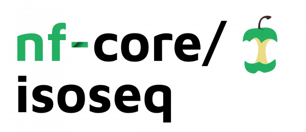

# GENE-SWitCH project Iso-Seq analysis pipeline

> **WARNING: This pipeline in very active development and didn't reach a stable stage yet.**

<!-- #  -->

**Run standard isoseq3 pipeline from PacBio, map resulting transcripts on a reference genome, and post-process the gene model with TAMA framework**.

[](https://github.com/FAANG/proj-gs-iso-seq/actions)
[](https://github.com/FAANG/proj-gs-iso-seq/actions)
[](https://www.nextflow.io/)

[](https://bioconda.github.io/)
[](https://hub.docker.com/r/nfcore/isoseq)
[](https://nfcore.slack.com/channels/isoseq)

## Introduction

<!-- TODO nf-core: Write a 1-2 sentence summary of what data the pipeline is for and what it does -->
**FAANG/proj-gs-iso-seq** is a bioinformatics best-practise analysis pipeline for generation of consensus reads from isoseq HiFi sequencing. It perform all steps from consensus computing and polishing to mapping on reference genome.

The pipeline is built using [Nextflow](https://www.nextflow.io), a workflow tool to run tasks across multiple compute infrastructures in a very portable manner. It comes with docker containers making installation trivial and results highly reproducible.
The pipeline can be decomposed in three phases:
* Transcripts sequence generation with the **isoseq3** framework
* Transcripts mapping with **minimap2**
* Gene model cleaning with **TAMA framework** (https://github.com/GenomeRIK/tama)

## Quick Start

1. Install [`nextflow`](https://nf-co.re/usage/installation)

2. Install any of [`Docker`](https://docs.docker.com/engine/installation/), [`Singularity`](https://www.sylabs.io/guides/3.0/user-guide/), [`Podman`](https://podman.io/), [`Shifter`](https://nersc.gitlab.io/development/shifter/how-to-use/) or [`Charliecloud`](https://hpc.github.io/charliecloud/) for full pipeline reproducibility _(please only use [`Conda`](https://conda.io/miniconda.html) as a last resort; see [docs](https://nf-co.re/usage/configuration#basic-configuration-profiles))_

3. Download the pipeline and test it on a minimal dataset with a single command:

    ```bash
    nextflow run FAANG/proj-gs-iso-seq -profile test,<docker/singularity/podman/shifter/charliecloud/conda/institute>
    ```

    > Please check [nf-core/configs](https://github.com/nf-core/configs#documentation) to see if a custom config file to run nf-core pipelines already exists for your Institute. If so, you can simply use `-profile <institute>` in your command. This will enable either `docker` or `singularity` and set the appropriate execution settings for your local compute environment.

4. Start running your own analysis!

    <!-- TODO nf-core: Update the example "typical command" below used to run the pipeline -->

    ```bash
    nextflow run FAANG/proj-gs-iso-seq -profile <docker/singularity/podman/shifter/charliecloud/conda/institute> --input 'path/to/bam_directory' --primers primers.fa --fasta galgal6.fa
    ```

See [usage docs](https://nf-co.re/isoseq/usage) for all of the available options when running the pipeline.

## Pipeline Summary

By default, the pipeline currently performs the following:
 
<!-- TODO nf-core: Fill in short bullet-pointed list of default steps of pipeline -->

* Generate highly accurate consensus sequence (`ccs`)
* Identification of barcode and primer sequences (`lima`)
* poly(A) tails trimming and + Rapid concatemer identification and removal (`isoseq3 refine`)
* Clustering and polishing of consensus (`isoseq3 cluster`)
* fastq extraction (`samtools fastq`)
* Mapping on reference genome (`minimap2`)
* Conversion from sam to bam
* Split alignment per chromsomes (`bamtools`)
* Clean gene model by collapsing similar one together (`TAMA Collapse`)
* Merge chromosomes per sample (`TAMA Merge`)

## Documentation

The FAANG/proj-gs-iso-seq pipeline comes with documentation about the pipeline: [usage](https://nf-co.re/isoseq/usage) and [output](https://nf-co.re/isoseq/output).

<!-- TODO nf-core: Add a brief overview of what the pipeline does and how it works -->

## Credits

FAANG/proj-gs-iso-seq was originally written by Sébastien Guizard.

We thank the following people for their extensive assistance in the development
of this pipeline:
* Mick Watson's group From The Roslin institute for their support
* Richard Kuo for his advises
* GENE-SWITCH WP2 for sharing their knowledge

<!-- TODO nf-core: If applicable, make list of people who have also contributed -->

## Contributions and Support

If you would like to contribute to this pipeline, please see the [contributing guidelines](.github/CONTRIBUTING.md).

For further information or help, don't hesitate to get in touch on the [Slack `#isoseq` channel](https://nfcore.slack.com/channels/isoseq) (you can join with [this invite](https://nf-co.re/join/slack)).

## Citations

<!-- TODO nf-core: Add citation for pipeline after first release. Uncomment lines below and update Zenodo doi. -->
<!-- If you use FAANG/proj-gs-iso-seq for your analysis, please cite it using the following doi: [10.5281/zenodo.XXXXXX](https://doi.org/10.5281/zenodo.XXXXXX) -->

You can cite the `nf-core` publication as follows:

> **The nf-core framework for community-curated bioinformatics pipelines.**
>
> Philip Ewels, Alexander Peltzer, Sven Fillinger, Harshil Patel, Johannes Alneberg, Andreas Wilm, Maxime Ulysse Garcia, Paolo Di Tommaso & Sven Nahnsen.
>
> _Nat Biotechnol._ 2020 Feb 13. doi: [10.1038/s41587-020-0439-x](https://dx.doi.org/10.1038/s41587-020-0439-x).

In addition, references of tools and data used in this pipeline are as follows:

<!-- TODO nf-core: Add bibliography of tools and data used in your pipeline -->

## About

The GENE-SWitCH project has received funding from the European Union’s Horizon 2020 research and innovation program under Grant Agreement No 817998.

This repository reflects only the listed contributors views. Neither the European Commission nor its Agency REA are responsible for any use that may be made of the information it contains.